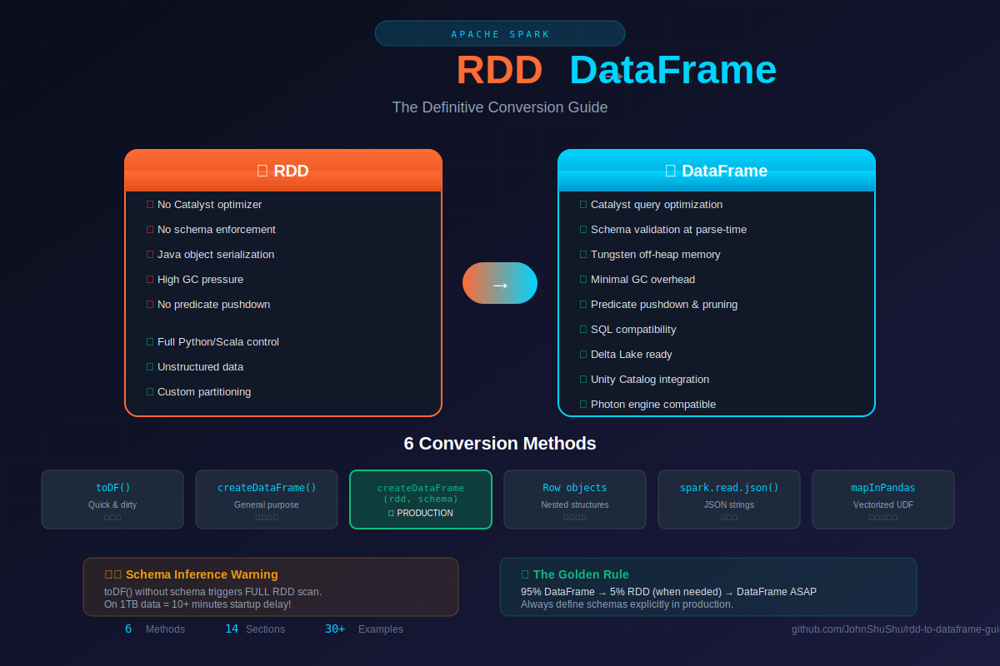

# RDD → DataFrame: The Definitive Guide

<p align="center">
  
</p>

> The complete guide to converting Resilient Distributed Datasets to Spark DataFrames — covering every method, schema strategy, and production pipeline pattern you'll encounter in real data engineering work.

## Overview

| Stat | Value |
|------|-------|
| Conversion Methods | 6 |
| Sections | 14 |
| Code Examples | 30+ |
| Pipeline Patterns | ∞ |

## Why Migrate from RDD to DataFrame?

RDDs are Spark's foundational abstraction — immutable, fault-tolerant collections distributed across a cluster. DataFrames unlock the **Catalyst query optimizer** and **Tungsten execution engine**, making them dramatically faster for most workloads.

### RDD vs DataFrame

| Aspect | RDD | DataFrame |
|--------|-----|-----------|
| Query Optimization | ❌ No Catalyst optimizer | ✅ Catalyst rewrites query plan |
| Schema | ❌ No enforcement (runtime errors) | ✅ Validation at parse-time |
| Memory | ❌ Java object serialization (high GC) | ✅ Tungsten off-heap (minimal GC) |
| I/O Optimization | ❌ No predicate pushdown | ✅ Predicate pushdown, partition pruning |
| Ecosystem | ❌ Limited | ✅ Delta Lake, Unity Catalog, Photon ready |
| Use Case | ✅ Unstructured data, custom logic | ✅ 95% of pipeline work |

> **Golden Rule:** Stay in DataFrame land for 95% of your pipeline. Drop to RDD only for element-level Python control. Convert back to DataFrame as soon as structure is established.

## Table of Contents

1. [Conversion Methods Overview](#conversion-methods-overview)
2. [Schema Strategies](#schema-strategies)
3. [Row-Based Conversion](#row-based-conversion)
4. [Named Tuples & Dicts](#named-tuples--dicts)
5. [JSON & Semi-Structured](#json--semi-structured)
6. [ETL Pipeline Pattern](#etl-pipeline-pattern)
7. [Streaming Pipelines](#streaming-pipelines)
8. [Delta Lake Integration](#delta-lake-integration)
9. [Performance Pitfalls](#performance-pitfalls)
10. [Anti-Patterns](#anti-patterns)
11. [Quick Reference](#quick-reference)

---

## Conversion Methods Overview

| Method | Schema | Best For | Performance |
|--------|--------|----------|-------------|
| `toDF()` | Inferred/named cols | Simple tuples in notebooks | ⭐⭐⭐ |
| `createDataFrame(rdd)` | Inferred or explicit | General-purpose | ⭐⭐⭐⭐ |
| `createDataFrame(rdd, schema)` | Explicit StructType | **Production pipelines** | ⭐⭐⭐⭐⭐ |
| `Row` objects | Named fields | Complex nested structures | ⭐⭐⭐⭐ |
| `spark.read.json(rdd)` | Inferred from JSON | JSON string RDDs | ⭐⭐⭐ |
| `mapInPandas` | Explicit StructType | Pandas-native transforms | ⭐⭐⭐⭐⭐ |

---

## Schema Strategies

Schema definition is the **most important decision** when converting RDDs. Inferred schemas trigger a full RDD scan — never use inference in production.

```python
from pyspark.sql.types import (
    StructType, StructField, StringType, IntegerType,
    DoubleType, LongType, BooleanType, TimestampType,
    ArrayType, MapType
)

# ❌ AVOID: Schema inference (triggers full RDD scan)
df_inferred = rdd.toDF(["name", "age", "salary"])

# ✅ BEST: Explicit StructType (no scan, enforced at parse-time)
schema = StructType([
    StructField("name",   StringType(),  nullable=False),
    StructField("age",    IntegerType(), nullable=True),
    StructField("salary", DoubleType(),  nullable=True),
])
df = spark.createDataFrame(rdd, schema)

# ✅ ALSO GOOD: DDL string schema
ddl_schema = "name STRING NOT NULL, age INT, salary DOUBLE"
df_ddl = spark.createDataFrame(rdd, ddl_schema)
```

### Complex Nested Schema

```python
complex_schema = StructType([
    StructField("user_id", LongType(), False),
    StructField("address", StructType([  # Nested struct
        StructField("street", StringType(), True),
        StructField("city",   StringType(), True),
        StructField("zip",    StringType(), True),
    ]), True),
    StructField("tags",   ArrayType(StringType()), True),  # Array
    StructField("scores", MapType(StringType(), DoubleType()), True),  # Map
])
```

---

## Row-Based Conversion

The `Row` class gives you the most control over null handling and nested structures.

```python
from pyspark.sql import Row

# Parse CSV lines to Row objects with null handling
def parse_csv_to_row(line: str) -> Row:
    parts = line.split(",")
    return Row(
        name = parts[0].strip(),
        age  = int(parts[1]) if parts[1].strip() else None,
        dept = parts[2].strip(),
    )

row_rdd = raw_rdd.map(parse_csv_to_row)
df = spark.createDataFrame(row_rdd, schema)
```

### Nested Rows

```python
Address = Row("street", "city", "zip")
Person  = Row("name", "age", "address")

nested_rdd = spark.sparkContext.parallelize([
    Person("alice", 30, Address("123 Main", "Dallas", "75201")),
    Person("bob",   25, Address("456 Oak",  "Austin", "78701")),
])
```

---

## Named Tuples & Dicts

```python
from collections import namedtuple
from dataclasses import dataclass, asdict

# Pattern 1: namedtuple RDD
Employee = namedtuple("Employee", ["emp_id", "name", "salary"])
emp_rdd = sc.parallelize([Employee(1, "Alice", 95000.0)])
emp_df = spark.createDataFrame(emp_rdd, schema)

# Pattern 2: dict RDD → Row RDD
EXPECTED_FIELDS = ["transaction_id", "amount", "currency"]
row_rdd = dict_rdd.map(lambda d: Row(**{k: d.get(k) for k in EXPECTED_FIELDS}))

# Pattern 3: dataclass RDD
@dataclass
class SensorReading:
    sensor_id: str
    temperature: float

row_rdd = sensor_rdd.map(lambda s: Row(**asdict(s)))
```

---

## JSON & Semi-Structured

```python
from pyspark.sql.functions import from_json, col

# Method A: spark.read.json (infers schema)
df = spark.read.json(json_rdd)

# Method B: from_json with explicit schema (RECOMMENDED)
event_schema = StructType([
    StructField("id", LongType(), False),
    StructField("event", StringType(), True),
    StructField("user", StructType([
        StructField("name", StringType(), True),
        StructField("tier", StringType(), True),
    ]), True),
])

parsed_df = (
    json_rdd.toDF(["raw_json"])
    .withColumn("parsed", from_json(col("raw_json"), event_schema))
    .select("parsed.*")
)
```

---

## ETL Pipeline Pattern

```
┌──────────────┐    ┌──────────────┐    ┌──────────────┐    ┌──────────────┐
│   Raw Files  │ →  │  RDD Stage   │ →  │  DataFrame   │ →  │  Delta Lake  │
│    Kafka     │    │Parse/Validate│    │Transform/Join│    │   Parquet    │
└──────────────┘    └──────────────┘    └──────────────┘    └──────────────┘
```

See [examples/etl_pipeline.py](examples/etl_pipeline.py) for complete implementation.

---

## Performance Pitfalls

| Pitfall | Impact | Solution |
|---------|--------|----------|
| Schema inference on large RDDs | Minutes of startup delay | Always define explicit schema |
| Collecting to driver | OOM crashes | Use DataFrame aggregations |
| Python UDFs in hot paths | 10-100x slower | Use Spark SQL functions or Pandas UDFs |
| Repeated RDD → DF conversions | Unnecessary shuffles | Convert once, cache DataFrame |
| No partitioning strategy | Shuffle-heavy joins | Partition by join keys |

---

## Anti-Patterns

```python
# ❌ ANTI-PATTERN: Collecting to driver
data = rdd.collect()  # OOM on large data!
df = spark.createDataFrame(data)

# ✅ CORRECT: Direct conversion
df = spark.createDataFrame(rdd, schema)

# ❌ ANTI-PATTERN: Python UDF for simple logic
@udf(StringType())
def upper(s):
    return s.upper() if s else None

# ✅ CORRECT: Built-in function
from pyspark.sql.functions import upper
df.withColumn("name_upper", upper(col("name")))

# ❌ ANTI-PATTERN: Multiple small conversions
for file in files:
    rdd = sc.textFile(file)
    df = rdd.toDF()  # Creates many small DataFrames
    df.write.mode("append")...

# ✅ CORRECT: Batch processing
all_rdd = sc.textFile("path/to/files/*")
df = spark.createDataFrame(all_rdd.map(parse), schema)
```

---

## Quick Reference

```python
# Simple tuple RDD → DataFrame
df = rdd.toDF(["col1", "col2", "col3"])

# With explicit schema (RECOMMENDED)
df = spark.createDataFrame(rdd, schema)

# From Row objects
row_rdd = rdd.map(lambda x: Row(a=x[0], b=x[1]))
df = spark.createDataFrame(row_rdd, schema)

# From JSON strings
df = spark.read.json(json_string_rdd)

# With DDL schema
df = spark.createDataFrame(rdd, "id LONG, name STRING, value DOUBLE")

# From pandas (vectorized)
@pandas_udf(schema, PandasUDFType.GROUPED_MAP)
def process(pdf): return pdf

df = df.groupby("key").apply(process)
```

---

## Repository Structure

```
rdd-to-dataframe-guide/
├── README.md
├── assets/
│   └── rdd-to-dataframe-visual.svg
├── src/
│   ├── schema_strategies.py
│   ├── row_conversion.py
│   ├── json_parsing.py
│   └── performance_utils.py
├── examples/
│   ├── etl_pipeline.py
│   ├── streaming_pipeline.py
│   └── delta_lake_integration.py
└── docs/
    └── anti_patterns.md
```

## Requirements

- Apache Spark 3.x+
- PySpark
- Delta Lake (optional)

## Contributing

Contributions welcome! Please submit PRs with:
- Clear code examples
- Performance benchmarks where applicable
- Real-world use cases

## License

MIT License

---

**Found this useful?** ⭐ Star the repo and share with your team!

[](https://github.com/JohnShuShu)
